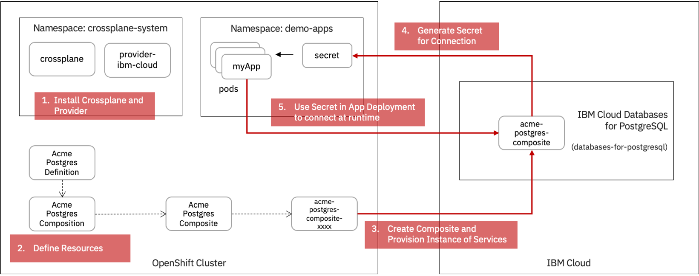

# Crossplane with OpenShift
Introduction to Crossplane and walkthrough of using it on the OpenShift platform. The goal is to explore how the OpenShift application deployment model and Crossplane as a control plane for managing composite platform services work together through the DevOps lifecycle of an application.

## Summary

*the overall setup and consumption of resources using Crossplane*

To demonstrate Crossplane in action on OpenShift we will use IBM Cloud as the service provider. Its cloud services will be used as the domain specific "stack" of services that an example application will be deployed and consume.

Red Hat OpenShift is an open source hybrid cloud platform for building and scaling containerised application. It is built with enterprise grade security and for lifecycle of projects at scale. In doing so it can bring a consistent application and operations lifecycle experiencehas in whichever location it operates.

In this introduction we show Crossplane installed in an OpenShift cluster. This show us how this hybrid cloud control plane can run from any OpenShift installation. We then additionally install providers for Crossplane, specifically IBM Cloud for this example. With this in place we can start to define enterprise specific, opinionated platform stacks that applications can consume.

Crossplane as a control plane instantiates custom resource objects in Kubernetes that represent the state and parameters by which the underlying provider cloud services need to exist. The power of Crossplan is that it maintains this state of the platform services so that the deployed application has precise known guardrails at point of consumption.

## Contents

1. [Installing Crossplane on OpenShift](1.%20Installing%20Crossplane%20on%20Openshift/README.md)  

2. [Provision of a Cloud Service using Crossplane](2.%20Provision%20PostgreSQL%20Database/README.md)

3. [Creating Domain Specific Composite Resources for Consumption](3.%20Exploring%20Composite%20Resources/README.md)

4. [Example of Building a Full Stack of App and its Domain Specific Services](4.%20Build%20a%20Full%20Stack/README.md)
